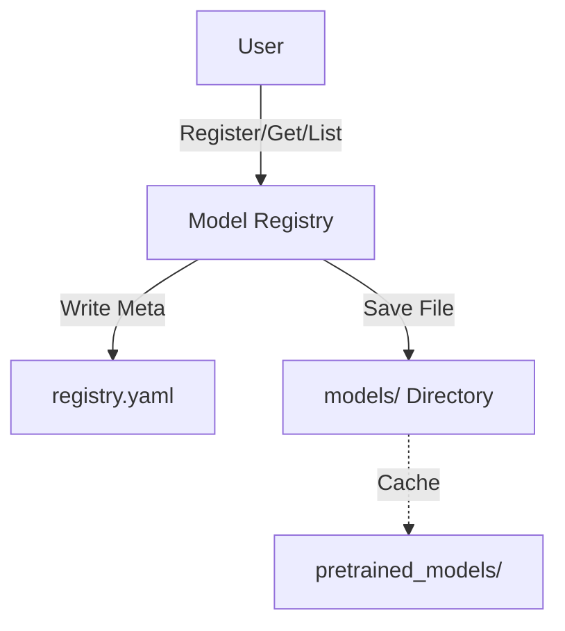

# Lightweight Model Registry
ML 모델 파일(`.pth`, `.pt`)의 무분별한 버전 파편화를 막고, 중앙에서 체계적으로 관리하기 위한 **경량화된 레지스트리 시스템**입니다.
---

## 1. 프로젝트 개요

### 해결하고자 하는 문제
- **파일명 혼란:** `model_v1.pt`, `model_final.pt` 등 비직관적인 파일명으로 인한 버전 관리의 어려움.
- **메타데이터 부재:** 모델 파일만 남고, 학습 데이터셋이나 성능 지표가 유실되는 문제.
- **재현성 부족:** 과거 모델의 스펙을 파악하기 어려워 실험 재현이 불가능함.

### 솔루션 핵심
- **중앙화된 관리:** 로컬 파일 시스템(`models/`)을 백엔드로 사용하여 모든 모델 관리.
- **불변성(Immutability):** 등록된 버전은 수정되지 않으며, 새로운 변경은 새 버전으로 기록.
- **메타데이터 동기화:** 모델 아티팩트와 성능 지표를 하나의 단위로 취급.

---

## 2. 주요 기능 및 과제 요구사항 충족 (Core Features)

과제에서 요구한 **필수 핵심 기능**을 모두 구현했습니다.

1. **모델 등록 및 패밀리 지원 (Model Registration)**
   - 메타데이터(이름, 버전, 프레임워크)와 함께 모델을 등록합니다.
   - `resnet18`과 같은 **모델 패밀리(Family)** 단위로 관리합니다.
2. **모델 조회와 Fallback (Model Retrieval)**
   - 이름과 버전으로 모델을 가져오며, **"latest" 쿼리** 및 저장소 위치 변경에 대응하는 **경로 자동 조정(Fallback)** 기능을 제공합니다.
3. **메타데이터 및 리니지 관리 (Metadata Management)**
   - 아키텍처, 입력 Shape, 성능 지표를 저장하고, **리니지(Lineage)**(데이터셋, 날짜 등)를 추적하여 모델의 기원을 관리합니다.
4. **저장소 백엔드 (Storage Backend)**
   - 외부 DB 없이 **로컬 파일 시스템(Local File System)**을 백엔드로 사용하여 동작합니다.
5. **시맨틱 버전 관리 (Versioning)**
   - `v1`, `v2` 형식의 **시맨틱 버저닝**을 지원하며, 특정 모델의 모든 버전 목록을 나열할 수 있습니다.

---

## 3. 차별화 요소 및 최적화 (Advanced Features)

실제 프로덕션 환경을 고려하여 추가로 구현한 기능들입니다.

### I. 목적별 조회 전략 분리 (`latest` vs `best`)
조회 목적에 따라 옵션을 분리하여 유연성을 확보했습니다

- **latest:** 시간상 가장 최신 버전을 조회 (실험 이력 추적용)
- **best:** 메트릭(Accuracy 등)이 가장 높은 버전을 조회 (실제 배포용)

### II. 스마트 캐싱 (Smart Caching)
- 데모 실행 시 `pretrained_models/`에 원본 파일을 캐싱하여 **중복 다운로드를 방지**합니다.
- 네트워크 트래픽을 줄이고 반복 실행 속도를 개선했습니다.

### III. 데이터 정합성 검증 (Safety Fallback)
- 메타데이터(registry.yaml)와 실제 파일 시스템(models/) 간의 상태가 일치하지 않는 상황을 방지합니다.   
- 모델 조회 시 메타데이터에 정보가 있더라도 실제 파일이 삭제되었는지 `os.path.exists`로 검증하고, 없을 경우 경고(Warning)를 제공합니다.

### IV. 작업 공간 분리 (Workspace Organization)
- 원본 다운로드 파일(`pretrained_models/`)과 레지스트리 저장소(`models/`)를 물리적으로 분리하여 작업 공간을 깔끔하게 유지합니다.

---

## 4. 설치 및 실행

### 사전 요구사항
* Python 3.10+ (권장)
* `requirements.txt`에 명시된 패키지 설치

> ⚠️ **주의:** <br>
> 제출 파일의 용량 최적화(<200MB)를 위해 `models/` 디렉토리와 `registry.yaml` 파일은 초기화된 상태로 제출하였습니다.
> 아래의 **데모 스크립트를 실행하면 필요한 폴더와 파일들이 자동으로 생성**됩니다.

### 데모 실행 가이드

```bash
# 1. 의존성 설치
pip install -r requirements.txt

# 2. 데모 스크립트 실행
python example.py
```

### 데모 시나리오
스크립트(`example.py`) 실행 시 다음 프로세스가 자동으로 수행됩니다:


1.  **다운로드 & 캐싱:** `pretrained_models/` 폴더에 다음 두 가지 모델을 다운로드합니다.
    *   **ResNet-18:** 일반 비전(General Vision) 모델
    *   **DenseNet-121:** 의료 영상(Medical AI, Chest X-ray) 표준 모델
2.  **모델 등록 (Simulation):**
    *   **v1 등록:** ResNet-18 원본을 `v1`으로 등록합니다.
    *   **v2 등록 (성능 개선):** 동일 모델을 `v2`로 등록하되, **Metrics를 높게 설정**하여 성능이 개선된 상황을 시뮬레이션합니다.
    *   **Medical Model 등록:** DenseNet-121을 `chest_xray_densenet` 패밀리로 등록합니다.
3.  **지능형 조회 검증:**
    *   `latest` 쿼리로 `v2`가 조회되는지 확인합니다.
    *   `best` 쿼리로 성능이 가장 좋은 `v2`가 선택되는지 검증합니다.
4.  **결과 리포트:** 전체 모델 목록과 저장된 메타데이터 요약을 출력합니다.



---

## 5. 사용 가이드 및 API 명세

### Python API 예제

```python
from registry import ModelRegistry

registry = ModelRegistry()

# 1. 모델 등록
registry.register(name="resnet18", model_path="...", metrics={"acc": 0.95})

# 2. 모델 조회 (Best)
model = registry.get("resnet18", version="best")
```

### API 상세 명세

| 메서드 | 설명 | 파라미터 (Input) | 실행 결과 (Output) |
|:---:|---|---|---|
| **`register`** | 모델 등록 및 버전 부여 | `name`, `model_path`, `metrics` | ID 반환 (`"resnet18/v1"`) |
| **`get`** | 메타데이터 조회 | `name`, `version` ("latest"/"best") | 모델 정보 Dict 반환 |
| **`list`** | 모델 목록 반환 | `name` (Optional) | 리스트 반환 (`["v1", "v2"]`) |


---