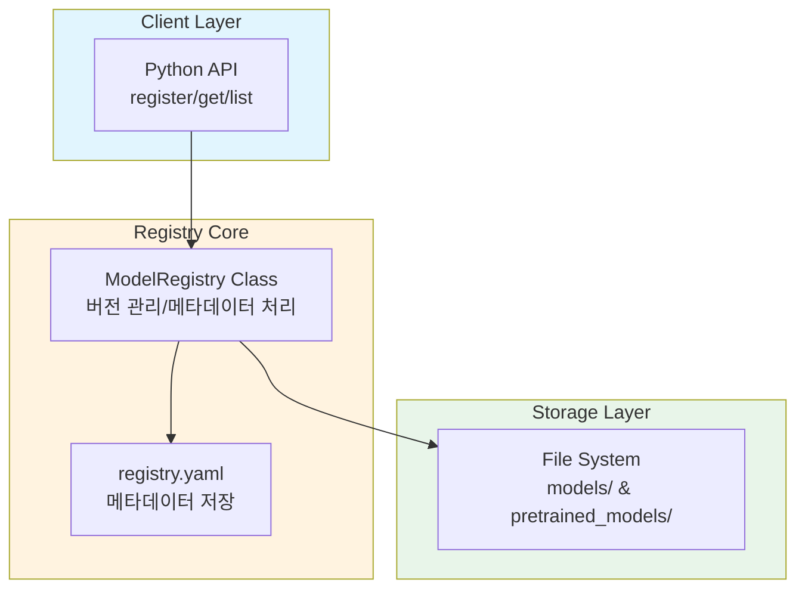
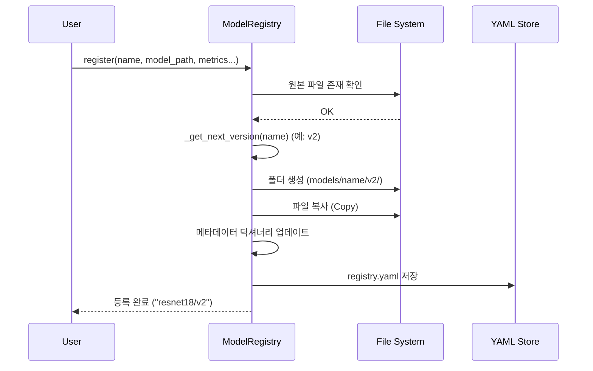
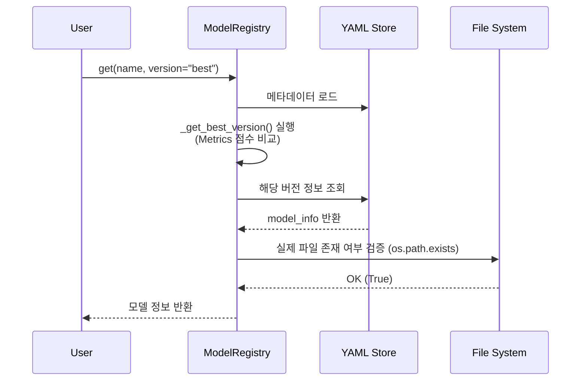

# Lightweight Model Registry - System Design

## 1. 배경 조사

### 모델 레지스트리가 해결하는 문제

ML/AI 개발 과정에서 자주 발생하는 문제들:

1. **무분별한 파일명 증가**
   - `model.pt` → `model_v2.pt` → `model_final.pt`
   - 어떤 모델이 최신인지, 어떤 성능을 냈는지 파일명만으로는 알 수 없음

2. **메타데이터 분실**
   - 모델 파일만 있고, 어떤 데이터셋으로 학습했는지 기록이 유실됨
   - 실험 재현 불가능

3. **버전 관리 부재**
   - 과거 버전으로 롤백하고 싶어도 어떤 파일이 v1인지 알 수 없음

**본 프로젝트의 솔루션:**
- 중앙화된 저장소(`models/`)로 모든 모델을 체계적으로 관리
- 버전을 불변(immutable)으로 관리하여 재현성 보장
- 메타데이터(`registry.yaml`)와 모델 파일을 함께 저장하여 추적 가능

---

## 2. 아키텍처 다이어그램

### 시스템 구성 요소와 상호작용



### 전체 디렉토리 구조 (Directory Structure)

```
Root/
├── registry.py             # [Core] 레지스트리 소스 코드
├── example.py              # [Demo] 데모 스크립트
├── requirements.txt        # [Config] 의존성 목록
├── registry.yaml           # [Metadata] 모델 정보 저장 (자동생성)
├── pretrained_models/      # [Cache] 원본 다운로드 파일
└── models/                 # [Storage] 레지스트리 저장소 (자동생성)
    ├── resnet18/           # [Family] 일반 비전 모델
    │   ├── v1/
    │   └── v2/
    └── chest_xray_densenet/# [Family] 의료용 모델 (DenseNet)
        └── v1/
```

---

## 3. 핵심 구성 요소 상세 (Core Components)

### ModelRegistry 클래스 (`registry.py`)

시스템의 핵심 로직을 담당하는 클래스입니다. 주요 메서드의 역할과 내부 동작 방식은 다음과 같습니다.

| 메서드 (Method) | 역할 (Role) | 내부 동작 (Internal Logic) |
|---|---|---|
| **`__init__`** | 초기화 | 저장 경로(`models/`) 생성 및 YAML 메타데이터 로드 |
| **`register`** | 모델 등록 | 1. 원본 파일 존재 확인<br>2. `_get_next_version`으로 새 버전 부여<br>3. `shutil.copy2`로 파일 복사<br>4. 메타데이터 업데이트 및 저장 |
| **`get`** | 모델 조회 | 1. `latest` 요청 시 `_get_latest_version` 호출<br>2. `best` 요청 시 `_get_best_version` 호출<br>3. 최종 경로에 파일이 있는지 `os.path.exists` 검증 |
| **`_get_next_version`** | 버전 자동 생성 | 기존 버전 목록(`v1`, `v2`...)을 파싱하여 최대값 + 1 반환 |
| **`_save_metadata`** | 데이터 영속화 | 메모리상의 딕셔너리를 `registry.yaml` 파일로 덤프(Dump) |

---

## 4. 디자인 결정 (Design Decisions)

### A. 저장 전략 및 버전 관리

- **계층적 폴더 구조:** `models/{이름}/{버전}/` 구조를 사용하여 직관적인 탐색이 가능합니다.
- **시맨틱 버저닝:** `v1`, `v2` 형식의 단순하고 명확한 버전 체계를 사용합니다. (Git 해시보다 사람이 읽기 쉬움)

### B. 기술 선택: 왜 YAML인가?

과제의 규모와 로컬 환경을 고려하여 **YAML**을 선택했습니다.

| 기술 | 장점 | 단점 | 선택 이유 |
|---|---|---|---|
| **YAML** | **가독성 높음**, 수동 편집 가능 | 파싱 속도가 상대적으로 느림 | **✓ 채택:** 디버깅이 쉽고 과제 규모에 적합 |
| **SQLite** | 강력한 쿼리, 트랜잭션 지원 | 설정이 복잡하고 **과도한 엔지니어링** | ✗ 제외: 단순 파일 관리에 불필요 |
| **JSON** | Python 기본 지원, 빠름 | 주석 불가능, 가독성 낮음 | ✗ 제외 |

### C. 모델 파일 관리: 복사(Copy) 방식

- **선택:** `shutil.copy2`를 사용하여 원본 파일을 레지스트리 폴더로 **복사**합니다.
- **이유:** 원본 파일(`pretrained_models/`)이 삭제되거나 수정되어도, 등록된 버전(`models/v1/`)은 안전하게 보존되어야 하기 때문입니다 (**불변성 보장**).

---

## 5. 데이터 흐름 (Data Flow)

### 모델 등록 (Register) 프로세스



### 모델 조회 (Get) 프로세스

