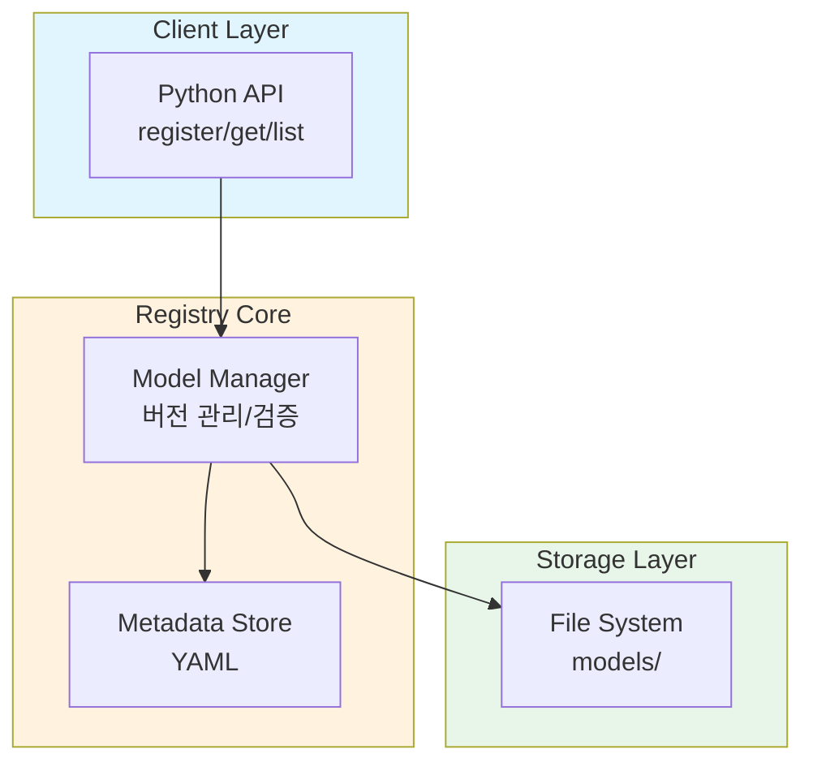
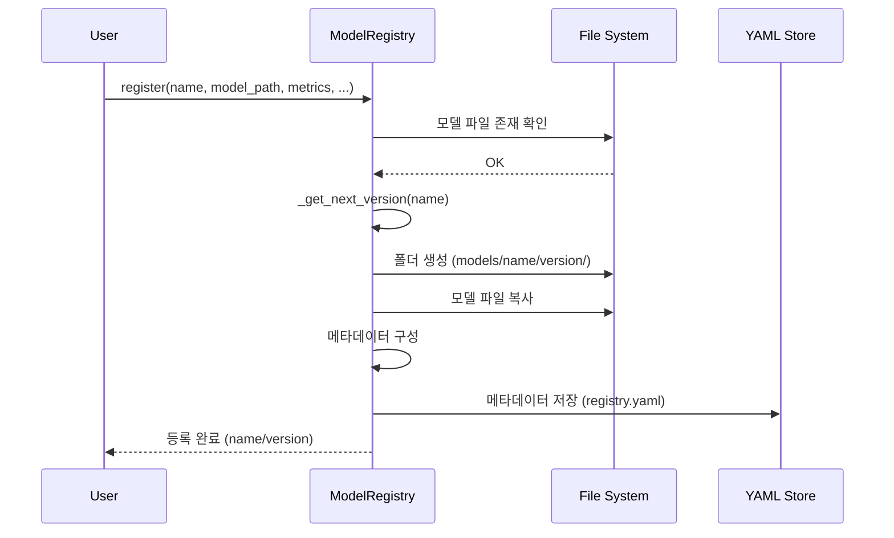
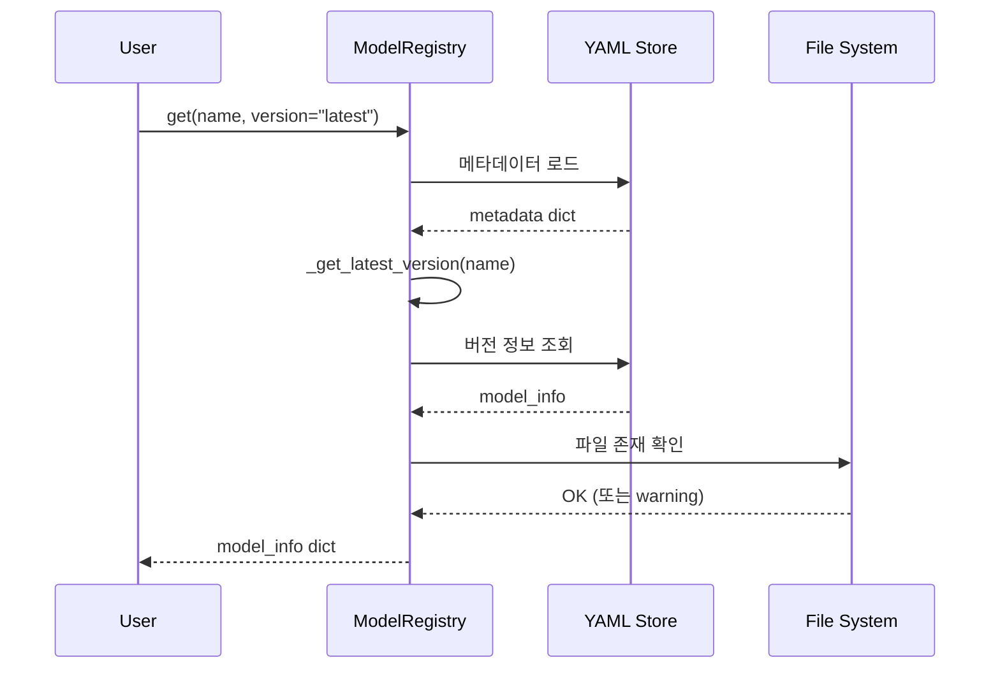
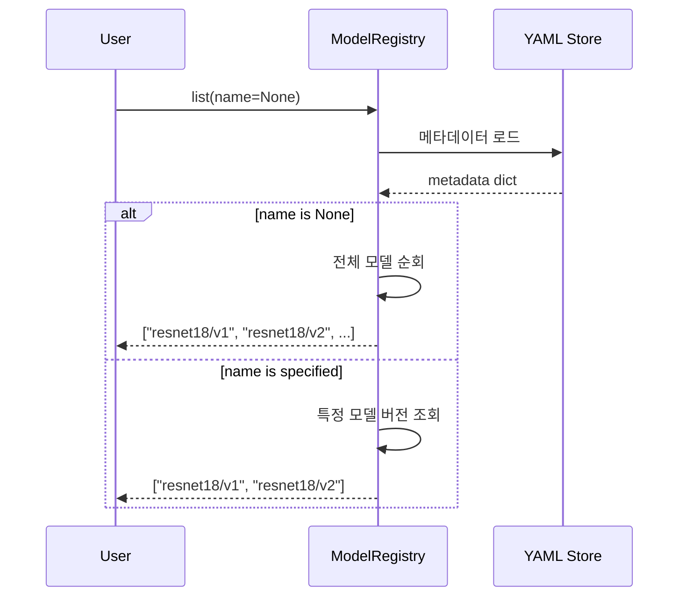

# 시스템 설계 문서

## 배경 조사

### 모델 레지스트리가 해결하는 문제

ML/AI 개발 과정에서 자주 발생하는 문제들:

1. **무분별한 파일명 증가**
   - `model.pt` → `model_v2.pt` → `model_final.pt` → `model_final_real.pt` → `model_final_real_최종.pt`
   - 어떤 모델이 최신인지, 어떤 성능을 냈는지 파일명만으로는 알 수 없음

2. **메타데이터 분실**
   - 모델 파일만 있고, 어떤 데이터셋으로 학습했는지, 성능이 어떤지 기록이 없음
   - 실험 재현 불가능

3. **버전 관리 부재**
   - 과거 버전으로 롤백하고 싶어도 어떤 파일이 v1인지 알 수 없음
   - 팀원들과 협업 시 혼선 발생

**모델 레지스트리의 솔루션:**
- 중앙화된 저장소로 모든 모델을 체계적으로 관리
- 버전을 불변(immutable)으로 관리하여 재현성 보장
- 메타데이터와 모델 파일을 함께 저장하여 추적 가능

### 기존 솔루션에서 배운 디자인 패턴

#### 1. MLflow Model Registry
**배운 점:**
- 모델 패밀리(family) 개념: 동일 모델의 여러 버전을 그룹화
- 스테이지 개념: Staging, Production, Archived 등
- 메타데이터 중심 설계

**우리 구현에 적용:**
- 모델 패밀리 개념 채택 (`resnet18/v1`, `resnet18/v2`)
- 메타데이터를 YAML로 저장하여 가독성 확보

**적용하지 않은 점:**
- 스테이지 개념: 과제 규모에는 과도함
- DB 백엔드: SQLite도 이 규모에는 오버엔지니어링

#### 2. HuggingFace Hub
**배운 점:**
- Git-like 버전 관리 (커밋 해시, 브랜치)
- Model Card를 통한 상세한 문서화
- 원격 저장소와 로컬 캐시 분리

**우리 구현에 적용:**
- 간단한 버전 관리 (v1, v2, v3)
- 메타데이터에 description 필드 추가

**적용하지 않은 점:**
- Git 기반 버전 관리: 과제에는 시맨틱 버저닝으로 충분
- 원격 저장소: 로컬 파일 시스템만 사용 (과제 요구사항)

## 아키텍처 다이어그램

### 시스템 구성 요소와 상호작용



### 데이터 저장 구조

```
models/
├── resnet18/
│   ├── v1/
│   │   └── resnet18_pretrained.pth
│   └── v2/
│       └── resnet18_pretrained.pth
└── mobilenetv2/
    └── v1/
        └── mobilenetv2_pretrained.pth

registry.yaml (메타데이터)
├── resnet18:
│   ├── v1: {name, version, file_path, metrics, ...}
│   └── v2: {name, version, file_path, metrics, ...}
└── mobilenetv2:
    └── v1: {name, version, file_path, metrics, ...}
```

## 핵심 구성 요소

### 1. Client Layer (Python API)

**책임:**
- 사용자 인터페이스 제공
- 입력 검증
- 결과 포맷팅 및 출력

**주요 메서드:**
- `register()`: 모델 등록
- `get()`: 모델 조회
- `list()`: 모델 목록 조회
- `print_summary()`: 요약 정보 출력

### 2. Registry Core (Model Manager)

**책임:**
- 비즈니스 로직 처리
- 버전 관리
- 메타데이터 CRUD 작업
- 파일 시스템 조작

**주요 기능:**
- 버전 자동 증가 (`_get_next_version()`)
- 최신 버전 조회 (`_get_latest_version()`)
- 메타데이터 로드/저장 (`_load_metadata()`, `_save_metadata()`)

### 3. Storage Layer (File System)

**책임:**
- 모델 파일 물리적 저장
- 폴더 구조 관리
- 메타데이터 파일 저장

**구조:**
- `models/{name}/{version}/{file}.pth` 패턴
- `registry.yaml` 단일 메타데이터 파일

## 디자인 결정

### 1. 저장 전략 및 버전 관리 체계

#### 저장 전략

**선택: 계층적 폴더 구조**
```
models/
└── {model_name}/
    └── {version}/
        └── {model_file}
```

**장점:**
- 직관적이고 탐색하기 쉬움
- OS 파일 시스템 도구로도 쉽게 관리 가능
- 버전별로 격리되어 안전함

**단점:**
- 같은 모델 파일이 여러 버전에 중복 저장될 수 있음 (디스크 공간)
- 심볼릭 링크나 하드 링크로 해결 가능하나, 과제 규모에는 불필요

#### 버전 관리

**선택: 시맨틱 버저닝 (v1, v2, v3...)**

**이유:**
- 단순하고 이해하기 쉬움
- 자동 증가 로직 구현이 간단함
- "latest" 쿼리 지원 가능

**대안:**
- Git 커밋 해시: 너무 복잡함
- 날짜 기반 (2024-12-17-001): 사람이 읽기 어려움
- 의미적 버저닝 (1.0.0): 과제 규모에 과도함

### 2. 기술 선택: YAML vs JSON vs SQLite

| 기술 | 장점 | 단점 | 선택 이유 |
|------|------|------|-----------|
| **YAML** | ✓ 가독성 최고<br>✓ 수동 편집 쉬움<br>✓ 주석 가능 | △ 파싱 속도 약간 느림<br>△ 복잡한 쿼리 불가 | **✓ 선택** - 과제 규모에 최적 |
| JSON | ✓ Python 기본 지원<br>✓ 빠른 파싱 | ✗ 가독성 낮음<br>✗ 주석 불가 | △ 가독성 때문에 제외 |
| SQLite | ✓ 강력한 쿼리<br>✓ 트랜잭션 지원 | ✗ 과도한 엔지니어링<br>✗ 설정 복잡 | ✗ 과제 FAQ 권장 사항 |

**최종 선택: YAML**

**근거:**
1. 과제 FAQ: "과도한 엔지니어링 지양", "로컬 파일 시스템 권장"
2. 수백 개 이상의 모델을 관리하는 게 아니므로 쿼리 성능 불필요
3. 사람이 직접 열어서 확인하고 수정할 수 있는 것이 디버깅에 유리

### 3. 고려한 트레이드오프

#### A. 메타데이터 저장 방식

**선택: 단일 YAML 파일**
- 장점: 간단함, 전체 조회 빠름
- 단점: 동시 쓰기 시 충돌 가능성

**대안: 모델별 개별 파일**
- 장점: 동시 쓰기 안전
- 단점: 전체 목록 조회 시 파일 여러 개 읽어야 함

**결정 이유:**
과제는 단일 사용자 환경을 가정하므로 단일 파일로 충분. 동시성 문제는 고려 불필요.

#### B. 모델 파일 복사 vs 참조

**선택: 파일 복사 (shutil.copy2)**
- 장점: 원본 파일 수정/삭제와 독립적
- 단점: 디스크 공간 사용

**대안: 심볼릭 링크**
- 장점: 디스크 절약
- 단점: 원본 삭제 시 깨짐

**결정 이유:**
안정성 > 디스크 공간. 모델 2개만 저장하므로 디스크 공간은 문제 없음.

#### C. 버전 자동 증가 vs 수동 지정

**선택: 둘 다 지원**
```python
registry.register(name="resnet18", ...)  # 자동 v1, v2, v3
registry.register(name="resnet18", version="v1.5", ...)  # 수동
```

**이유:**
- 자동: 대부분의 경우 편리함
- 수동: 특수한 경우 (실험 버전, 브랜치 등) 유연성 제공

### 4. 특정 선택을 한 이유

#### 왜 클래스 기반 설계인가?

**선택: ModelRegistry 클래스**

**대안: 함수 기반**
```python
register_model(...)
get_model(...)
```

**클래스를 선택한 이유:**
1. **상태 관리**: `self.metadata`, `self.storage_path` 유지
2. **확장성**: 나중에 캐싱, 로깅 등 추가하기 쉬움
3. **객체지향 원칙**: 단일 책임, 응집도 높음

#### 왜 Private 메서드를 사용했는가?

`_load_metadata()`, `_get_next_version()` 등

**이유:**
- 내부 구현 세부사항을 숨김 (캡슐화)
- 공개 API가 단순해짐
- 나중에 내부 로직 변경해도 사용자 코드는 영향 없음

## 데이터 흐름

### 1. 모델 등록 (Register) 흐름



**단계별 설명:**

1. **입력 검증**
   - 모델 파일 존재 확인
   - 필수 파라미터 체크

2. **버전 결정**
   - `version` 파라미터가 None이면 자동 증가
   - 기존 버전들 조회 후 최대값 + 1

3. **파일 저장**
   - 대상 디렉토리 생성: `models/{name}/{version}/`
   - 모델 파일 복사: `shutil.copy2()`

4. **메타데이터 업데이트**
   - 메타데이터 딕셔너리 구성
   - YAML 파일에 저장

5. **결과 반환**
   - 등록된 모델명 (`{name}/{version}`) 반환

### 2. 모델 조회 (Get) 흐름



**단계별 설명:**

1. **버전 해석**
   - `version="latest"` → `_get_latest_version()` 호출
   - 숫자가 가장 큰 버전 반환

2. **메타데이터 조회**
   - `self.metadata[name][version]` 접근

3. **파일 경로 검증**
   - 실제 파일 존재 확인
   - 없으면 경고 메시지 출력

4. **결과 반환**
   - 딕셔너리 복사본 반환 (원본 보호)

### 3. 모델 목록 조회 (List) 흐름



## 확장 가능성

현재 구현은 최소 기능에 집중했지만, 향후 확장 가능한 포인트:

1. **원격 저장소 지원**
   - S3, Google Cloud Storage 등 클라우드 저장소
   - 추상화 레이어 추가 (StorageBackend 인터페이스)

2. **모델 로딩 헬퍼**
   - `registry.load_model("resnet18", "latest")` → 실제 PyTorch 모델 객체 반환

3. **검색 및 필터링**
   - 메트릭 기준 검색: `registry.search(min_accuracy=0.9)`
   - 데이터셋 기준 필터: `registry.filter(dataset="ImageNet")`

4. **모델 스테이징**
   - Development, Staging, Production 단계 관리

5. **캐싱**
   - 자주 사용하는 메타데이터 메모리 캐싱

6. **REST API**
   - Flask/FastAPI로 HTTP API 제공
   - 팀 내 공유 레지스트리로 확장

## 결론

이 설계는 **단순성과 실용성**에 중점을 두었습니다. 과제 요구사항인 "4-6시간 작업", "과도한 엔지니어링 지양", "코어 기능 집중"을 모두 만족하면서도, 실제 ML 프로젝트에서 바로 사용할 수 있을 만큼 완성도 있는 시스템을 구현했습니다.

**핵심 원칙:**
- YAGNI (You Aren't Gonna Need It): 필요한 기능만 구현
- KISS (Keep It Simple, Stupid): 단순한 솔루션 선호
- Readability Counts: 코드와 데이터 모두 사람이 읽기 쉽게
