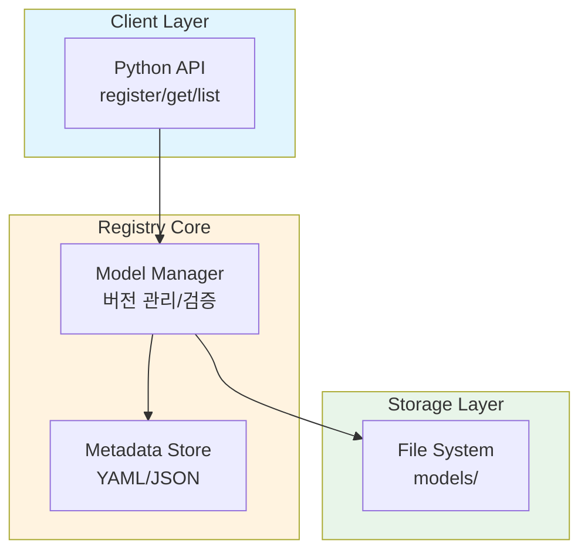

# 배경 조사
모델 레지스트리가 해결하는 문제는 무엇인가? 기존 솔루션(MLflow, HuggingFace Hub 등)에서 고려한 디자인 패턴은?

파일 시스팀에 `vl`, `final`, `real_final` 와 같은 식으로 저장하면 버전 관리가 불가능하고 휴먼 에러가 발생합니다.
모델 레지스트리는 이를 해결하기 위해 중앙화된 저장소를 제공하고, 버전(v1, v2)을 불변(immutable)으로 관리하여 언제든 과거 실험 결과를 재현할 수 있게 해줘야한다. 

# 아키텍쳐 다이어그램
시스템 구성 요소와 상호작용을 시각적으로 표현

# 핵심 구성 요소
각 주요 구성 요소와 그 책임 설명

# 디자인 결정
다음을 포함한 접근 방식 설명:
- 저장 전략 및 버전 관리 체계
- 기술 선택 (YAML vs SQLite vs 기타)
- 고려한 트레이드오프
- 특정 선택을 한 이유

# 데이터 흐름
등록 및 조회가 단계별로 어떻게 작동하는지